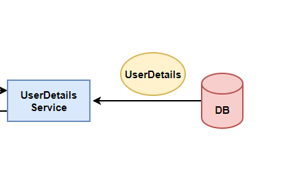

# Spring Security JWT Authentication

### 1. Plot

### 2. Authentication and authorization

#### Authentication
Authentication: Authentication is the process of verifying the identity of a user or entity. It ensures that the user claiming to access a system or resource is indeed who they claim to be. In the context of web security, authentication is the process of validating the credentials provided by a user, such as a username and password, to determine their identity.

Authentication mechanisms can vary depending on the application and the level of security required. Some common authentication methods include:

- Form-based authentication: Users provide their credentials (username and password) through a login form.
- Basic authentication: Credentials are sent with each request in the form of a username and password encoded in the HTTP headers.
- Token-based authentication: Tokens, such as JSON Web Tokens (JWT), are used to authenticate and authorize users.

Once a user's identity is verified through authentication, the system can associate their identity with a security context, which contains information such as their roles, permissions, and other relevant attributes. This security context is typically stored and managed during a user's session.

#### Authorization
Authorization: Authorization is the process of determining whether a user has the necessary privileges and permissions to access a specific resource or perform a certain action. It ensures that authenticated users only have access to the resources and functionalities they are allowed to use based on their roles, permissions, or other authorization rules.

Authorization controls the level of access a user has based on factors such as their role, group membership, or specific permissions assigned to them. It prevents unauthorized access to sensitive data and functionalities within an application.

Authorization is typically implemented by defining access control rules and associating them with resources or endpoints. These rules specify who can access the resources and what actions they can perform. Authorization mechanisms often include concepts such as roles, permissions, access control lists (ACLs), or attribute-based access control (ABAC).

In summary, authentication verifies the identity of a user, while authorization controls what a user can access or do within a system based on their authenticated identity. Both authentication and authorization play essential roles in ensuring the security and protection of web applications and resources.

### 3. Security Filter Chain

Spring Security Filter Chain is a crucial component of the Spring Security framework, which provides authentication and authorization features for Java applications. It is responsible for processing incoming HTTP requests, applying security measures, and managing access control.

The Spring Security Filter Chain consists of a series of filters that are applied in a specific order to incoming requests. Each filter performs a specific security-related task, such as authentication, authorization, session management, CSRF protection, etc. These filters work together to enforce security policies and protect the application from unauthorized access.

When a request reaches the Spring Security Filter Chain, the filters are executed in the defined order. Each filter can perform its designated task and can also decide whether to pass the request to the next filter in the chain or abort the chain's execution.

By configuring and customizing the Spring Security Filter Chain, you can control how requests are processed and secured in your application, enabling you to implement various security features and mechanisms to protect your application's resources.

### 4. ser Details Service

Pulls UserDetail from the Database.

### 5. Users and Roles

